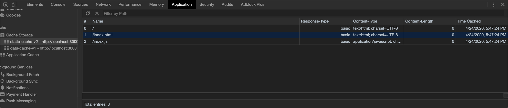
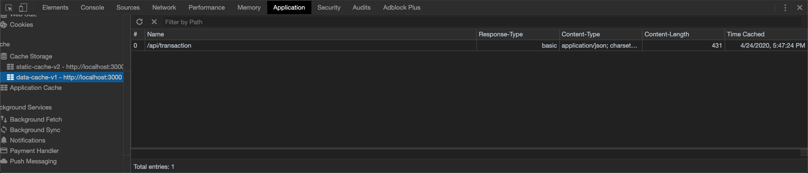

# pwa-example

This is an example Progressive Web Application with detailed steps to make it fully functional. It will not be publicly available after Tuesday, April 28, 2020.

## Setup

1. Copy the files and folders from your Develop folder in the 18-PWA/02-Homework folder. Commit.
2. Install node packages

```js
npm install
```

Commit

3. Test your application
   - Start the server: `node server.js`
   - Visit http://localhost:3000 and confirm that the application works correctly.
   - In Robo 3T, confirm that after adding an entry to your budget, that you now see a budget database and a transactions collection.


## Create the Web Manifest

For the following steps, reference activity 14, 18-PWA/01-Activities/14-Stu_Notetaker_PWA

1. Create a new file in your public folder. Call it `manifest.webmanifest`. Commit.
2. Copy the JSON from activity 14 Solved folder and edit as follows:
   - Modify the name and short_name to match our current app, "Budget App"
   - Modify the icons array to match the two icons provided for you in the Develop folder.
     - HINT: You will need to change the paths for the icons.
3. Link your `manifest.webmanifest` file to your index.html the same way we did in activity 14.

```html
<link rel="manifest" href="manifest.webmanifest" />
```

4. Test your manifest is being read by starting your app and opening up the Application tab in the browser.

   **HINT: Because we have used PORT 3000 for several of our in class apps, your first step should be to clear all application data.**


If you cleared your site data, simply reload the page and visit the manifest section under the Application tab. You should see a few warnings.

5. Commit

## Add Offline Storage with IndexedDB

1. Copy the db.js file from 17-NoSQL/01-Activities/26-Stu-Mini-Project/Solved/public into your budget app public folder.
2. Link your db.js file in your index.html

```html
<script src="db.js"></script>
```

3. Test that the app works offline by setting your Network tab to Offline and adding a transaction. You should see the http call fail, but the transaction still appears on the screen.


Additionally, you should see your transaction stored in the IndexedDB under Application -> Storage -> IndexedDB -> budget - http://localhost:3000 -> pending


4. Commit

## Create the Service Worker

1. Create a new `service-worker.js` file in your public folder.
2. Modify the `service-worker.js` file to include the following:

```js
const FILES_TO_CACHE = [
    "/",
    "/index.html",
    "db.js",
    "favicon.ico",
    "index.js",
    "manifest.webmanifest",
    "service-worker.js",
    "/icons/icon-192x192.png",
    "/icons/icon-512x512.png",
    "styles.css"
  ];

const CACHE_NAME = "static-cache-v1";
const DATA_CACHE_NAME = "data-cache-v1";

// install
self.addEventListener("install", function (evt) {
  evt.waitUntil(
    caches
      .open(CACHE_NAME)
      .then((cache) => {
        console.log("Your files were pre-cached successfully!");
        cache
          .addAll(FILES_TO_CACHE)
          .then((result) => {
            // debugger;
            console.log("result of add all", result);
          })
          .catch((err) => {
            // debugger;
            console.log("Add all error: ", err);
          });
      })
      .catch((err) => {
        console.log(err);
      })
  );

  self.skipWaiting();
});

// activate
self.addEventListener("activate", function (evt) {
  evt.waitUntil(
    caches.keys().then((keyList) => {
      return Promise.all(
        keyList.map((key) => {
          if (key !== CACHE_NAME && key !== DATA_CACHE_NAME) {
            console.log("Removing old cache data", key);
            return caches.delete(key);
          }
        })
      );
    })
  );

  self.clients.claim();
});

// fetch
self.addEventListener("fetch", function (evt) {
  if (evt.request.url.includes("/api/")) {
    evt.respondWith(
      caches
        .open(DATA_CACHE_NAME)
        .then((cache) => {
          return fetch(evt.request)
            .then((response) => {
              // If the response was good, clone it and store it in the cache.
              if (response.status === 200) {
                cache.put(evt.request.url, response.clone());
              }

              return response;
            })
            .catch((err) => {
              // Network request failed, try to get it from the cache.
              return cache.match(evt.request);
            });
        })
        .catch((err) => console.log(err))
    );

    return;
  }

  evt.respondWith(
    caches.open(CACHE_NAME).then((cache) => {
      return cache.match(evt.request).then((response) => {
        return response || fetch(evt.request);
      });
    })
  );
});

```

3. Include the following script in your `index.html`

```html
<script>
  if ("serviceWorker" in navigator) {
    window.addEventListener("load", () => {
      navigator.serviceWorker.register("service-worker.js").then((reg) => {
        console.log("We found your service worker file!", reg);
      });
    });
  }
</script>
```

4. Copy the favicon.ico file from this application's public directory.

5. Confirm your application is reading your service worker by visiting the Application tab and clicking Service Workers.

6. Refresh the page twice. Now, you should see both your static-cache and your data-cache in the Cache Storage section.




7. Confirm you are able to access your application offline by selecting Service Workers, and checking the "Offline" checkbox. 
